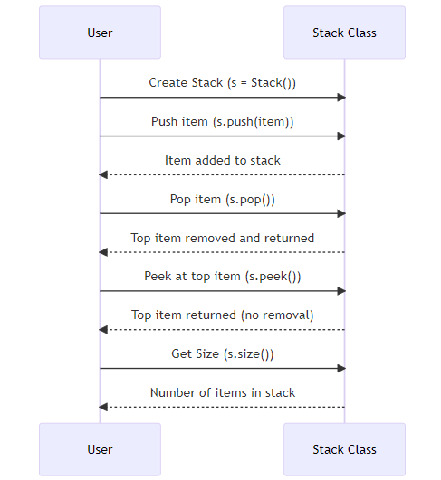

# Python Data Structures Tutorial

## Introduction

Hello Python beginners! Welcome to this tutorial on data structures, where we'll learn about the Stack. Let's begin by understanding what a data structure is.

In computer science, a data structure is a particular way of collecting and organizing data so that we can perform operations on this data efficiently. They are the foundation of any complex programming task. In this tutorial, we're focusing on the Stack.

## What is a Stack?

A Stack is a data structure that operates on a Last In First Out (LIFO) principle. This means that the last element added is the first one to be removed.

Think about a stack of books. The last book you put on top of the stack is the first one you'll take off when you start removing books from the stack. That's how a Stack works in programming!

## Implementing a Stack in Python

In Python, we can use a built-in data structure called a list to simulate a Stack. We will define a Stack as a class, which is a blueprint for creating objects in Python.

Here is a class called Stack that we'll use to simulate a stack of items:

```python
class Stack:
def **init**(self):
self.stack = []

    def push(self, item):
        self.stack.append(item)

    def pop(self):
        if len(self.stack) < 1:
            return None
        return self.stack.pop()

    def peek(self):
        if self.stack:
            return self.stack[-1]
        return None

    def size(self):
        return len(self.stack)

```



Let's break down what this class does:

- `__init__`: This method runs when we create a new Stack object. It sets up an empty list that will hold our stack items.
- `push`: This method adds an item to the top of the stack. It's like placing a book on top of a stack of books.
- `pop`: This method removes the top item from the stack and returns it. It's like picking up the top book from a stack of books.
- `peek`: This method lets us look at the top item on the stack without removing it. Imagine glancing at the title of the top book in a stack without lifting it off the stack.
- `size`: This method tells us how many items are currently in the stack. Like counting how many books are in a stack of books.

## Using a Stack

Here's how we can use the Stack class to perform stack operations:

```python

# We start by creating a new Stack

s = Stack()

# We can add items to the Stack using the push method

s.push("Hello")
s.push("World")

# Printing the Stack should show that "Hello" was added first, and then "World"

print(s.stack) # Output: ['Hello', 'World']

# Removing the top item from the Stack using the pop method should return "World"

print(s.pop()) # Output: 'World'

# Printing the Stack now should show only "Hello" since "World" was removed

print(s.stack) # Output: ['Hello']

# Looking at the top item of the Stack using the peek method should return "Hello"

print(s.peek()) # Output: 'Hello'

# Finally, we can check the size of the Stack using the size method, which should return 1

print(s.size()) # Output: 1
```

## Conclusion

And that wraps up this introduction to the Stack data structure in Python! Understanding data structures like the Stack is crucial in programming, as they can significantly improve the efficiency of your code.

In our upcoming tutorials, we will explore more fascinating data structures like Linked Lists and Trees. Keep an eye out for them!

Feel free to reach out at lee17005@byui.edu for any further queries or assistance. Happy coding!
