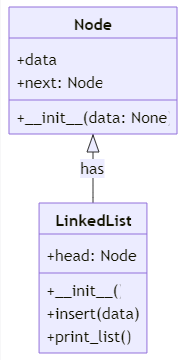
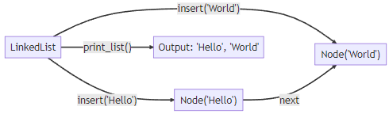

# Python Data Structures Tutorial 2

## What is a Linked List?

A Linked List is a linear data structure where each element is a separate object. Each element (we call it a node) of a list consists of two items - the data and a reference to the next node. The last node has a reference to null. The entry point into a linked list is called the head of the list.

Think about a chain of paperclips linked together. Each paperclip represents a node with a reference to the next paperclip in the chain. That's how a Linked List works in programming!

## Implementing a Linked List in Python

In Python, we can create a class to represent the nodes of the list, and another class to represent the list itself. Here is a class called Node and another called LinkedList that we'll use to simulate a linked list of items:

```python
class Node:
    def __init__(self, data=None):
        self.data = data
        self.next = None

class LinkedList:
    def __init__(self):
        self.head = None

    def insert(self, data):
        if not self.head:
            self.head = Node(data)
        else:
            current = self.head
            while current.next:
                current = current.next
            current.next = Node(data)

    def print_list(self):
        current = self.head
        while current:
            print(current.data)
            current = current.next
```



## Big O Notation in Context of Linked List Operations

Big O notation is a mathematical notation that describes the limiting behavior of a function when the argument tends towards a particular value or infinity. In computer science, Big O notation is used to classify algorithms according to how their run time or space requirements grow as the input size grows.

We'll now explain the Big O notation for the Linked List operations as described in the code above:

- `insert`: This method involves appending an item to the end of the list. In the worst case, this operation takes linear time, as we may need to traverse all the nodes. Therefore, the time complexity is O(n), where n is the number of elements in the list.

- `print_list`: This method involves traversing the list and printing each element. This operation takes linear time, as we need to visit each node once. Therefore, the time complexity is O(n), where n is the number of elements in the list.

In summary, the methods of the LinkedList class described above have a time complexity of O(n), which means they take an amount of time proportional to the number of elements in the list. This is one of the reasons why linked lists are efficient for certain tasks, such as inserting elements at the beginning of the list.

## Using a Linked List

Here's how we can use the LinkedList class to perform linked list operations:

```python
# We start by creating a new LinkedList
ll = LinkedList()

# We can add items to the LinkedList using the insert method
ll.insert("Hello")
ll.insert("World")

# Printing the LinkedList should show that "Hello" was added first, and then "World"
ll.print_list() # Output: 'Hello', 'World'
```



## Conclusion

And that wraps up this introduction to the Linked List data structure in Python! Understanding data structures like the Linked List is crucial in programming, as they can significantly improve the efficiency of your code.

In our upcoming tutorials, we will explore more fascinating data structures like Stacks and Trees. Keep an eye out for them!

Feel free to reach out at lee17005@byui.edu for any further queries or assistance. Happy coding!
