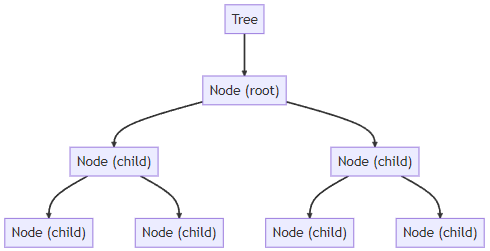
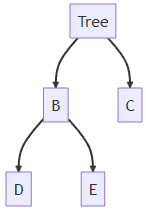

# Python Data Structures Tutorial 3

## Introduction

Welcome to this tutorial on data structures, where we'll learn about the Tree. Let's begin by understanding what a data structure is.

In computer science, a data structure is a particular way of collecting and organizing data so that we can perform operations on this data efficiently. They are the foundation of any complex programming task. In this tutorial, we're focusing on the Tree.

## What is a Tree?

A Tree is a non-linear data structure that simulates a hierarchical tree structure with a set of connected nodes. Unlike Arrays, Linked Lists, Stack and queues, which are linear data structures, a tree is hierarchical. It has a root, branches, and leaves.

## Implementing a Tree in Python

In Python, we can use a class to define a Tree. We will define a Tree as a class, which is a blueprint for creating objects in Python.

Here is a class called Tree that we'll use to simulate a tree of items:

```python
class Node:
    def __init__(self, data):
        self.data = data
        self.children = []

class Tree:
    def __init__(self, root):
        self.root = Node(root)

    def add_child(self, parent, child):
        parent_node = self.find(parent)
        if parent_node:
            parent_node.children.append(Node(child))

    def find(self, data, node=None):
        if node is None:
            node = self.root
        if node.data == data:
            return node
        for child in node.children:
            found_node = self.find(data, child)
            if found_node:
                return found_node
        return None
```



## Big O Notation in Context of Tree Operations

Big O notation is a mathematical notation that describes the limiting behavior of a function when the argument tends towards a particular value or infinity. In computer science, Big O notation is used to classify algorithms according to how their run time or space requirements grow as the input size grows.

We'll now explain the Big O notation for the Tree operations as described in the code above:

- `add_child`: This method involves finding the parent and appending a child to it. In the worst case, this operation takes linear time, as we may need to traverse all the nodes. Therefore, the time complexity is O(n), where n is the number of nodes in the tree.
- `find`: This method involves searching for a data value in the tree. In the worst case, we may need to visit all the nodes, so the time complexity is O(n), where n is the number of nodes in the tree.

In summary, the methods of the Tree class described above have a time complexity of O(n), which means they take an amount of time proportional to the number of nodes in the tree.

## Using a Tree

Here's how we can use the Tree class to perform tree operations:

## We start by creating a new Tree

t = Tree('A')

## We can add children to the Tree using the add_child method

t.add_child('A', 'B')
t.add_child('A', 'C')
t.add_child('B', 'D')
t.add_child('B', 'E')

## Printing the Tree should show that 'A' is the root, 'B' and 'C' are children of 'A', and 'D' and 'E' are children of 'B'

print(t.root.data) # Output: 'A'
print([child.data for child in t.root.children]) # Output: ['B', 'C']



## Conclusion

And that wraps up this introduction to the Tree data structure in Python! Understanding data structures like the Tree is crucial in programming, as they can significantly improve the efficiency of your code.

Feel free to reach out at lee17005@byui.edu for any further queries or assistance. Happy coding!
